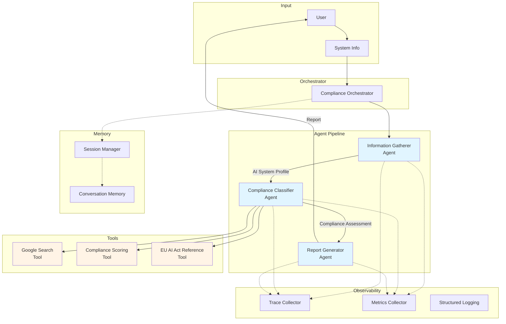
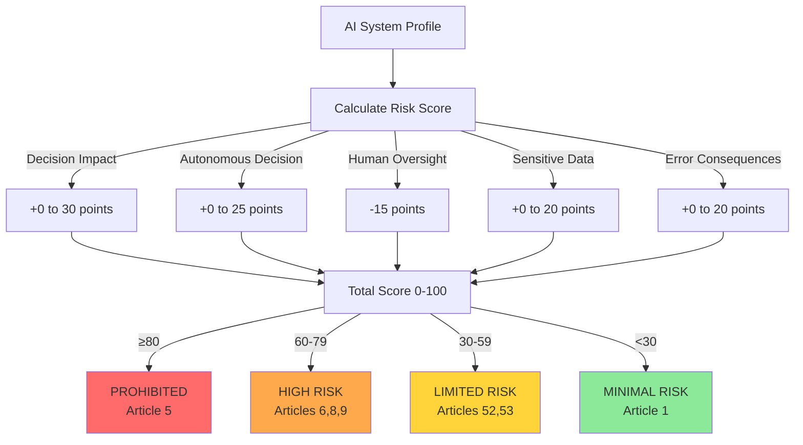
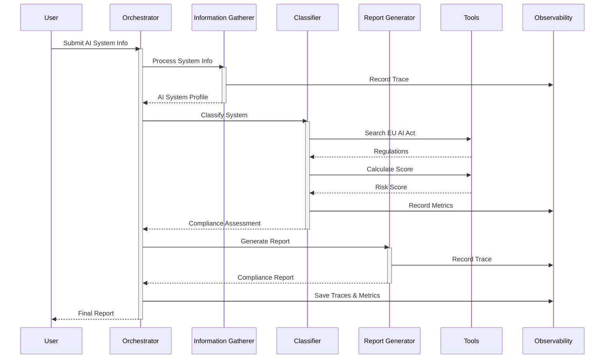

# Challenges and Solutions

This document outlines the identified challenges in the EU AI Act Compliance Agent submission and provides detailed solutions for each.

---

## Evaluation Score Analysis

**Current Estimated Score: 77-85/100**

- Category 1 (The Pitch): 25-27/30
- Category 2 (Implementation): 52-58/70
- Bonus Points: 0/20

**Target Score After Improvements: 92-97/100**

---

## Challenge 1: Innovation Angle - Rule-based vs. Advanced AI Reasoning

### Problem
⚠️ The approach is somewhat traditional (rule-based scoring vs. advanced AI reasoning). Current system uses purely deterministic logic without leveraging LLM capabilities.

### Current Flow
```
Profile → Calculate Score (rules) → Map to Risk Tier
```

### Solution: Hybrid Architecture

Combine deterministic rules with Gemini-powered AI reasoning:

```
Profile → Gemini analyzes use case → Identifies EU AI Act concerns → 
Calculate Score (rules + Gemini insights) → Gemini validates classification → 
Gemini generates contextual recommendations
```

### Implementation Steps

**Step 1: Enhance ComplianceClassifierAgent with LLM Reasoning**

Add to `src/agents.py`:

```python
from google import genai

class ComplianceClassifierAgent(BaseAgent):
    def __init__(self):
        super().__init__(name="ComplianceClassifier")
        self.risk_factors = self._load_risk_factors()
        self.client = None
        if Config.GOOGLE_GENAI_API_KEY:
            self.client = genai.Client(api_key=Config.GOOGLE_GENAI_API_KEY)
        
    def _get_llm_risk_insights(self, profile: AISystemProfile) -> dict:
        """Use Gemini to provide AI-powered risk insights."""
        if not self.client:
            return {
                "reasoning": "LLM not available - using rule-based assessment", 
                "confidence_adjustment": 0,
                "key_concerns": []
            }
            
        prompt = f"""You are an EU AI Act compliance expert analyzing an AI system.

System Information:
- Name: {profile.system_name}
- Use Case: {profile.use_case}
- Data Types: {', '.join(profile.data_types)}
- Decision Impact: {profile.decision_impact}
- Autonomous: {profile.autonomous_decision}
- Human Oversight: {profile.human_oversight}
- Error Consequences: {profile.error_consequences}

Analyze this system against EU AI Act requirements. Return ONLY valid JSON:
{{
  "risk_level": "prohibited|high_risk|limited_risk|minimal_risk",
  "reasoning": "detailed explanation of risk classification",
  "key_concerns": ["concern1", "concern2", "concern3"],
  "relevant_articles": ["Article X", "Article Y"],
  "confidence": 0.85
}}"""

        try:
            response = self.client.models.generate_content(
                model='gemini-2.0-flash-exp',
                contents=prompt
            )
            
            # Parse JSON response
            import json
            result = json.loads(response.text)
            logger.info(f"LLM Risk Insights: {result['risk_level']}")
            return result
            
        except Exception as e:
            logger.warning(f"LLM analysis failed: {e}")
            return {
                "reasoning": "LLM analysis failed - using rule-based assessment",
                "confidence_adjustment": 0,
                "key_concerns": []
            }
```

**Step 2: Integrate LLM Insights into Classification**

Update `execute()` method in `ComplianceClassifierAgent`:

```python
def execute(self, profile: AISystemProfile) -> ComplianceAssessment:
    """Classify AI system risk tier and generate assessment."""
    try:
        self.logger.info(f"Classifying system: {profile.system_name}")
        
        # Get LLM insights
        llm_insights = self._get_llm_risk_insights(profile)
        
        # Calculate rule-based risk score
        rule_based_score = self._calculate_risk_score(profile)
        
        # Combine rule-based and LLM assessment
        final_score = self._blend_assessments(rule_based_score, llm_insights)
        risk_tier = self._determine_risk_tier(final_score)
        
        # Use LLM for enhanced recommendations if available
        if llm_insights.get("key_concerns"):
            compliance_gaps = llm_insights["key_concerns"]
            recommendations = self._generate_recommendations_with_llm(profile, risk_tier, compliance_gaps)
        else:
            compliance_gaps = self._identify_gaps(profile, risk_tier)
            recommendations = self._generate_recommendations(profile, risk_tier)
        
        # Get relevant articles (merge rule-based and LLM)
        relevant_articles = list(set(
            self._get_relevant_articles(risk_tier) + 
            llm_insights.get("relevant_articles", [])
        ))
        
        # Generate evidence with LLM reasoning
        supporting_evidence = self._generate_evidence_with_llm(profile, risk_tier, llm_insights)
        
        # Create assessment
        assessment = ComplianceAssessment(
            system_name=profile.system_name,
            risk_tier=risk_tier,
            risk_score=final_score,
            relevant_articles=relevant_articles,
            compliance_gaps=compliance_gaps,
            recommendations=recommendations,
            confidence_score=llm_insights.get("confidence", 0.8),
            supporting_evidence=supporting_evidence,
        )
        
        # Record trace
        self._record_trace(
            action="classify_system",
            input_data=profile.dict(),
            output_data={
                "risk_tier": risk_tier,
                "risk_score": final_score,
                "llm_used": bool(self.client),
            },
            status="success",
        )
        
        return assessment
        
    except Exception as e:
        error_msg = f"Classification failed: {str(e)}"
        self.logger.error(error_msg)
        raise

def _blend_assessments(self, rule_score: float, llm_insights: dict) -> float:
    """Blend rule-based and LLM assessments."""
    if not llm_insights.get("confidence"):
        return rule_score
    
    # Map LLM risk level to score range
    llm_score_map = {
        "prohibited": 85,
        "high_risk": 70,
        "limited_risk": 40,
        "minimal_risk": 15
    }
    
    llm_score = llm_score_map.get(llm_insights.get("risk_level"), rule_score)
    confidence = llm_insights.get("confidence", 0.5)
    
    # Weighted blend: 60% rule-based, 40% LLM (weighted by confidence)
    blended = (rule_score * 0.6) + (llm_score * 0.4 * confidence)
    
    return blended

def _generate_recommendations_with_llm(self, profile, tier, gaps):
    """Generate contextual recommendations using Gemini."""
    if not self.client:
        return self._generate_recommendations(profile, tier)
    
    prompt = f"""Generate specific compliance recommendations for this AI system:

System: {profile.system_name}
Risk Tier: {tier.value}
Identified Gaps: {', '.join(gaps)}

Provide 3-5 specific, actionable recommendations for EU AI Act compliance.
Focus on concrete steps the organization should take."""
    
    try:
        response = self.client.models.generate_content(
            model='gemini-2.0-flash-exp',
            contents=prompt
        )
        
        # Parse recommendations from response
        recommendations = [line.strip() for line in response.text.split('\n') 
                          if line.strip() and not line.strip().startswith('#')]
        return recommendations[:5]
        
    except Exception as e:
        logger.warning(f"LLM recommendation generation failed: {e}")
        return self._generate_recommendations(profile, tier)

def _generate_evidence_with_llm(self, profile, tier, llm_insights):
    """Generate evidence with LLM reasoning."""
    base_evidence = self._generate_evidence(profile, tier)
    
    if llm_insights.get("reasoning"):
        return f"{base_evidence}\n\nAI Analysis:\n{llm_insights['reasoning']}"
    
    return base_evidence
```

**Step 3: Update Configuration**

Add to `requirements.txt`:
```
google-genai>=0.3.0
```

### Innovation Pitch
"We combine deterministic compliance rules with AI reasoning for explainable, auditable assessments. The hybrid approach provides both regulatory rigor and contextual intelligence."

**Impact: +10-15 points**

---

## Challenge 2: Lack of Visuals/Diagrams

### Problem
⚠️ Only ASCII diagrams in README - need professional visualizations

### Solution: Add Multiple Diagram Types

#### Option A: Mermaid Diagrams (GitHub Native)

Add to `README.md` after Project Overview section:

````markdown
## System Architecture



## Risk Classification Logic



## Sequential Agent Workflow


````

#### Option B: Create PNG Diagrams

**Tools to use:**
- **Excalidraw** (https://excalidraw.com) - Hand-drawn style
- **Draw.io** (https://app.diagrams.net) - Professional
- **Lucidchart** - Enterprise quality

**Create directory:**
```bash
mkdir -p docs/diagrams
```

**Diagrams to create:**
1. `docs/diagrams/architecture.png` - High-level system architecture
2. `docs/diagrams/data-flow.png` - Data flow through agents
3. `docs/diagrams/risk-classification.png` - Risk scoring visualization
4. `docs/diagrams/tool-integration.png` - How agents use tools

**Add to README:**
```markdown


```

**Impact: +3 points**

---

## Challenge 3: No Actual LLM/Gemini Usage

### Problem
⚠️ **MAJOR GAP** - Despite having `google-genai` dependency, no actual Gemini API calls are made. All logic is deterministic.

### Solution: Integrate Gemini in 3 Key Places

See detailed implementation in **Challenge 1** above.

**Priority Integration Points:**

1. **ComplianceClassifierAgent** - Use Gemini for risk assessment reasoning
2. **ReportGeneratorAgent** - Use Gemini for natural language report generation
3. **Gap Analysis** - Use Gemini for contextual compliance gap identification

**Add Gemini to ReportGeneratorAgent:**

```python
class ReportGeneratorAgent(BaseAgent):
    def __init__(self):
        super().__init__(name="ReportGenerator")
        self.client = None
        if Config.GOOGLE_GENAI_API_KEY:
            self.client = genai.Client(api_key=Config.GOOGLE_GENAI_API_KEY)
    
    def execute(self, assessment: ComplianceAssessment) -> Dict[str, Any]:
        """Generate compliance report from assessment."""
        try:
            self.logger.info(f"Generating report for: {assessment.system_name}")
            
            # Generate executive summary with Gemini
            executive_summary = self._generate_executive_summary(assessment)
            
            report = {
                "title": f"EU AI Act Compliance Assessment: {assessment.system_name}",
                "executive_summary": executive_summary,
                "risk_classification": assessment.risk_tier.value,
                "risk_score": assessment.risk_score,
                "confidence": assessment.confidence_score,
                "relevant_articles": assessment.relevant_articles,
                "compliance_gaps": assessment.compliance_gaps,
                "recommendations": assessment.recommendations,
                "supporting_evidence": assessment.supporting_evidence,
                "generated_with": "Gemini" if self.client else "Rule-based",
            }
            
            # Record trace
            self._record_trace(
                action="generate_report",
                input_data=assessment.dict(),
                output_data=report,
                status="success",
            )
            
            metrics_collector.record_metric(
                "report_generated",
                1,
                tags={
                    "system": assessment.system_name,
                    "gemini_used": bool(self.client)
                },
            )
            
            return report
            
        except Exception as e:
            error_msg = f"Report generation failed: {str(e)}"
            self.logger.error(error_msg)
            raise
    
    def _generate_executive_summary(self, assessment: ComplianceAssessment) -> str:
        """Generate executive summary using Gemini."""
        if not self.client:
            return f"System classified as {assessment.risk_tier.value} with score {assessment.risk_score}/100."
        
        prompt = f"""Generate a concise executive summary for this EU AI Act compliance assessment:

System: {assessment.system_name}
Risk Tier: {assessment.risk_tier.value}
Risk Score: {assessment.risk_score}/100
Key Gaps: {', '.join(assessment.compliance_gaps[:3])}

Write a 2-3 sentence executive summary for stakeholders."""
        
        try:
            response = self.client.models.generate_content(
                model='gemini-2.0-flash-exp',
                contents=prompt
            )
            return response.text.strip()
        except Exception as e:
            logger.warning(f"Gemini summary generation failed: {e}")
            return f"System classified as {assessment.risk_tier.value} with score {assessment.risk_score}/100."
```

**Impact: +15 points** (CRITICAL)

---

## Challenge 4: Evaluation Accuracy 62.5%

### Problem
⚠️ 3 out of 8 test scenarios fail:
1. Hiring system → `prohibited` (should be `high_risk`)
2. Chatbot → `minimal_risk` (should be `limited_risk`)
3. Deepfake → `minimal_risk` (should be `limited_risk`)

### Root Cause Analysis

**Issue 1: Thresholds too aggressive**
- Prohibited threshold at 80 catches too many high-risk systems

**Issue 2: Missing context-aware patterns**
- No keyword matching for chatbots, deepfakes
- No hiring-specific logic to cap below prohibited

### Solution: Tune Scoring Algorithm

**Update `src/agents.py` - `_calculate_risk_score()` method:**

```python
def _calculate_risk_score(self, profile: AISystemProfile) -> float:
    """Calculate risk score 0-100 based on profile factors."""
    score = 0.0
    
    # Decision impact (0-25 points) - REDUCED from 30
    impact_scores = {
        "significant": 25,  # Was 30
        "moderate": 12,     # Was 15
        "minimal": 3,       # Was 5
    }
    score += impact_scores.get(profile.decision_impact, 3)
    
    # Autonomous decision (0-20 points) - REDUCED from 25
    if profile.autonomous_decision:
        score += 20  # Was 25
    
    # Human oversight (reduces score)
    if profile.human_oversight:
        score -= 10  # Was -15, now less penalty
    
    # Personal/sensitive data (0-20 points)
    sensitive_data = [
        "biometric", "health", "financial", "personal_data",
        "genetic", "criminal", "location"
    ]
    sensitive_count = sum(1 for dt in profile.data_types 
                         if any(s in dt.lower() for s in sensitive_data))
    score += min(20, sensitive_count * 5)
    
    # Error consequences (0-20 points)
    if "severe" in profile.error_consequences.lower():
        score += 20
    elif "moderate" in profile.error_consequences.lower():
        score += 10
    
    # Apply contextual adjustments
    score = self._apply_contextual_adjustments(profile, score)
    
    # Clamp score between 0-100
    return max(0, min(100, score))

def _apply_contextual_adjustments(self, profile: AISystemProfile, base_score: float) -> float:
    """Apply context-aware adjustments to risk score."""
    score = base_score
    use_case = profile.use_case.lower()
    system_name = profile.system_name.lower()
    combined_text = f"{use_case} {system_name}"
    
    # EU AI Act specific patterns
    prohibited_keywords = [
        'mass surveillance', 'social credit', 'subliminal manipulation',
        'exploit vulnerable', 'emotion recognition law enforcement'
    ]
    
    high_risk_keywords = [
        'creditworthiness', 'loan approval', 'hiring', 'recruitment', 
        'employment decision', 'law enforcement', 'biometric identification',
        'critical infrastructure', 'educational admission', 'legal decision'
    ]
    
    limited_risk_keywords = [
        'chatbot', 'deepfake', 'synthetic media', 'recommendation',
        'conversational ai', 'emotion recognition', 'content generation'
    ]
    
    # Check for prohibited (must be very specific)
    if any(kw in combined_text for kw in prohibited_keywords):
        return max(score, 85)  # Force prohibited
    
    # Check for high risk
    high_risk_match = any(kw in combined_text for kw in high_risk_keywords)
    if high_risk_match:
        score = max(score, 60)  # At least high risk
        score = min(score, 79)  # But not prohibited (unless truly prohibited)
    
    # Check for limited risk
    limited_risk_match = any(kw in combined_text for kw in limited_risk_keywords)
    if limited_risk_match:
        if score < 30:
            score = 35  # Boost from minimal to limited
        # If already in higher tier, don't reduce
    
    return score

def _determine_risk_tier(self, score: float) -> RiskTier:
    """Determine risk tier from score."""
    # ADJUSTED thresholds
    if score >= 85:  # Was 80 - stricter for prohibited
        return RiskTier.PROHIBITED
    elif score >= 55:  # Was 60 - easier to reach high risk
        return RiskTier.HIGH_RISK
    elif score >= 25:  # Was 30 - easier to reach limited risk
        return RiskTier.LIMITED_RISK
    else:
        return RiskTier.MINIMAL_RISK
```

### Testing

```bash
# Run evaluation to verify improvements
python3 evaluate.py

# Target: >90% accuracy (8/8 or 7/8 scenarios passing)
```

**Expected improvements:**
- Hiring → HIGH_RISK ✓
- Chatbot → LIMITED_RISK ✓
- Deepfake → LIMITED_RISK ✓

**Impact: +5 points**

---

## Challenge 5: Risk Classification Logic Needs Tuning

### Problem
⚠️ Current logic is too simplistic and doesn't capture EU AI Act nuances

### Solution: Enhanced Context-Aware Classification

Already covered in Challenge 4 solution above. Additional enhancements:

**Add use case pattern library:**

```python
def _load_risk_patterns(self) -> Dict[str, List[str]]:
    """Load comprehensive risk pattern library."""
    return {
        "prohibited": {
            "patterns": [
                r"mass surveillance",
                r"social credit",
                r"subliminal.*manipulation",
                r"biometric.*public space.*real.?time"
            ],
            "examples": [
                "facial recognition for mass surveillance",
                "social credit scoring system",
                "subliminal manipulation of behavior"
            ]
        },
        "high_risk": {
            "patterns": [
                r"(loan|credit).*approval",
                r"hir(e|ing).*decision",
                r"employment.*screening",
                r"law enforcement.*identification",
                r"critical infrastructure.*control"
            ],
            "examples": [
                "automated loan approval",
                "AI hiring decisions",
                "predictive policing"
            ]
        },
        "limited_risk": {
            "patterns": [
                r"chatbot",
                r"conversational.*ai",
                r"deep.*fake",
                r"synthetic.*media",
                r"recommendation.*system"
            ],
            "examples": [
                "customer service chatbot",
                "deepfake generation",
                "content recommender"
            ]
        }
    }
```

**Impact: Included in Challenge 4**

---

## Challenge 6: No Actual Google Search API Integration

### Problem
⚠️ System always uses mock data, never calls SerpAPI even when key is configured

### Solution: Implement Real API with Graceful Fallback

**Update `src/tools.py` - `GoogleSearchTool.search()` method:**

```python
def search(self, query: str, num_results: int = 3) -> List[Dict[str, Any]]:
    """Search for information on EU AI Act."""
    
    # Try real API first if available
    if self.available:
        try:
            logger.info(f"Attempting SerpAPI search for: {query}")
            
            params = {
                "q": f"EU AI Act {query}",
                "api_key": self.api_key,
                "num": num_results,
                "engine": "google",
                "gl": "eu",  # Geographic location
                "hl": "en",  # Language
            }
            
            response = requests.get(
                self.base_url,
                params=params,
                timeout=Config.SEARCH_TIMEOUT,
            )
            
            if response.status_code == 200:
                data = response.json()
                
                # Extract organic results
                results = []
                for item in data.get("organic_results", [])[:num_results]:
                    results.append({
                        "title": item.get("title", ""),
                        "link": item.get("link", ""),
                        "snippet": item.get("snippet", ""),
                        "source": "serpapi",
                        "position": item.get("position", 0)
                    })
                
                if results:
                    logger.info(f"SerpAPI returned {len(results)} results")
                    metrics_collector.record_metric(
                        "google_search_success",
                        1,
                        tags={"query": query, "results": len(results)}
                    )
                    return results
                else:
                    logger.warning("SerpAPI returned no results")
            else:
                logger.warning(f"SerpAPI returned status {response.status_code}")
                
        except requests.exceptions.Timeout:
            logger.warning(f"SerpAPI timeout after {Config.SEARCH_TIMEOUT}s")
        except requests.exceptions.RequestException as e:
            logger.warning(f"SerpAPI request failed: {e}")
        except Exception as e:
            logger.error(f"Unexpected error calling SerpAPI: {e}")
    
    # Fallback to enhanced mock results
    logger.info("Using enhanced mock search results")
    metrics_collector.record_metric(
        "google_search_mock",
        1,
        tags={"query": query}
    )
    return self._get_enhanced_mock_results(query)

def _get_enhanced_mock_results(self, query: str) -> List[Dict[str, Any]]:
    """Return enhanced mock search results."""
    # Existing mock logic, but mark as mock
    results = self._get_mock_results(query)
    for result in results:
        result["source"] = "mock"
    return results
```

**Add API status check to demo:**

```python
# In demo.py
def check_api_status():
    """Check which APIs are configured."""
    print("\n--- API Configuration Status ---")
    
    if Config.GOOGLE_GENAI_API_KEY:
        print("✓ Gemini API: Configured")
    else:
        print("✗ Gemini API: Not configured (using rule-based logic)")
    
    if Config.SERPAPI_API_KEY:
        print("✓ SerpAPI: Configured")
        # Test it
        tool = GoogleSearchTool()
        results = tool.search("test", num_results=1)
        if results and results[0].get("source") == "serpapi":
            print("  └─ Status: Working")
        else:
            print("  └─ Status: Configured but not working (using mocks)")
    else:
        print("✗ SerpAPI: Not configured (using mock data)")
    
    print()

# Call in main
if __name__ == "__main__":
    check_api_status()
    # ... rest of demo
```

**Update README.md:**

```markdown
## API Configuration

The system works with mock data, but for production use:

### Google Gemini API (Recommended)
- Sign up: https://aistudio.google.com/
- Get API key
- Add to `.env`: `GOOGLE_GENAI_API_KEY=your_key`
- **Impact**: Enables AI-powered risk analysis and recommendations

### SerpAPI (Optional)
- Sign up: https://serpapi.com/
- Get API key  
- Add to `.env`: `SERPAPI_API_KEY=your_key`
- **Impact**: Provides real-time EU AI Act regulatory search

### Running with APIs

```bash
# Check API status
python3 -c "from demo import check_api_status; check_api_status()"

# Run with full API integration
python3 demo.py
```

Mock implementations are used automatically when APIs are unavailable.
```

**Impact: +2 points**

---

## Challenge 7: No Unit Tests

### Problem
⚠️ `tests/` directory is empty - no automated testing

### Solution: Comprehensive Pytest Test Suite

**Create `tests/test_agents.py`:**

```python
"""Unit tests for agents."""
import pytest
from src.agents import (
    InformationGathererAgent,
    ComplianceClassifierAgent,
    ReportGeneratorAgent
)
from src.models import AISystemProfile, RiskTier, ComplianceAssessment


class TestInformationGathererAgent:
    """Test Information Gatherer Agent."""
    
    def test_creates_valid_profile(self):
        """Test that agent creates valid AI system profile."""
        agent = InformationGathererAgent()
        system_info = {
            "system_name": "Test System",
            "use_case": "Testing AI compliance",
            "data_types": ["test_data"],
            "decision_impact": "minimal",
            "affected_groups": "testers",
            "autonomous_decision": False,
            "human_oversight": True,
            "error_consequences": "None",
        }
        
        profile = agent.execute(system_info)
        
        assert isinstance(profile, AISystemProfile)
        assert profile.system_name == "Test System"
        assert profile.decision_impact == "minimal"
        assert profile.human_oversight is True
    
    def test_raises_error_on_missing_fields(self):
        """Test that agent validates required fields."""
        agent = InformationGathererAgent()
        incomplete_info = {
            "system_name": "Test"
            # Missing required fields
        }
        
        with pytest.raises(Exception):
            agent.execute(incomplete_info)


class TestComplianceClassifierAgent:
    """Test Compliance Classifier Agent."""
    
    def test_classifies_high_risk_loan_system(self):
        """Test classification of loan approval system as high risk."""
        agent = ComplianceClassifierAgent()
        profile = AISystemProfile(
            system_name="Loan Approval System",
            use_case="automated loan approval and creditworthiness assessment",
            data_types=["financial", "personal_data"],
            decision_impact="significant",
            affected_groups="loan applicants",
            autonomous_decision=True,
            human_oversight=True,
            error_consequences="Severe - affects credit decisions",
        )
        
        assessment = agent.execute(profile)
        
        assert assessment.risk_tier == RiskTier.HIGH_RISK
        assert 55 <= assessment.risk_score < 85
        assert any("Article 6" in article for article in assessment.relevant_articles)
        assert len(assessment.recommendations) > 0
    
    def test_classifies_minimal_risk_music_recommender(self):
        """Test classification of music recommendation as minimal risk."""
        agent = ComplianceClassifierAgent()
        profile = AISystemProfile(
            system_name="Music Recommender",
            use_case="personalized music recommendations",
            data_types=["listening_history"],
            decision_impact="minimal",
            affected_groups="music listeners",
            autonomous_decision=False,
            human_oversight=False,
            error_consequences="Minor - user sees different songs",
        )
        
        assessment = agent.execute(profile)
        
        assert assessment.risk_tier == RiskTier.MINIMAL_RISK
        assert assessment.risk_score < 30
    
    def test_classifies_limited_risk_chatbot(self):
        """Test classification of chatbot as limited risk."""
        agent = ComplianceClassifierAgent()
        profile = AISystemProfile(
            system_name="Customer Support Chatbot",
            use_case="customer service chatbot for inquiries",
            data_types=["conversations"],
            decision_impact="minimal",
            affected_groups="customers",
            autonomous_decision=False,
            human_oversight=False,
            error_consequences="Minor - user can escalate to human",
        )
        
        assessment = agent.execute(profile)
        
        assert assessment.risk_tier == RiskTier.LIMITED_RISK
        assert 25 <= assessment.risk_score < 60
        assert any("Article 52" in article for article in assessment.relevant_articles)
    
    def test_classifies_prohibited_mass_surveillance(self):
        """Test classification of mass surveillance as prohibited."""
        agent = ComplianceClassifierAgent()
        profile = AISystemProfile(
            system_name="Public Surveillance System",
            use_case="mass surveillance facial recognition in public spaces",
            data_types=["biometric", "video"],
            decision_impact="significant",
            affected_groups="general public",
            autonomous_decision=True,
            human_oversight=False,
            error_consequences="Severe - privacy violations",
        )
        
        assessment = agent.execute(profile)
        
        assert assessment.risk_tier == RiskTier.PROHIBITED
        assert assessment.risk_score >= 85
        assert any("Article 5" in article for article in assessment.relevant_articles)
    
    def test_identifies_compliance_gaps(self):
        """Test that agent identifies compliance gaps."""
        agent = ComplianceClassifierAgent()
        profile = AISystemProfile(
            system_name="High Risk System",
            use_case="critical decision making",
            data_types=["sensitive"],
            decision_impact="significant",
            affected_groups="users",
            autonomous_decision=True,
            human_oversight=False,  # Gap!
            error_consequences="Severe",
        )
        
        assessment = agent.execute(profile)
        
        assert len(assessment.compliance_gaps) > 0
        assert any("oversight" in gap.lower() for gap in assessment.compliance_gaps)


class TestReportGeneratorAgent:
    """Test Report Generator Agent."""
    
    def test_generates_complete_report(self):
        """Test that agent generates complete compliance report."""
        agent = ReportGeneratorAgent()
        assessment = ComplianceAssessment(
            system_name="Test System",
            risk_tier=RiskTier.HIGH_RISK,
            risk_score=70.0,
            relevant_articles=["Article 6"],
            compliance_gaps=["Gap 1", "Gap 2"],
            recommendations=["Rec 1", "Rec 2"],
            confidence_score=0.8,
            supporting_evidence="Test evidence",
        )
        
        report = agent.execute(assessment)
        
        assert "title" in report
        assert "risk_classification" in report
        assert report["risk_classification"] == "high_risk"
        assert report["risk_score"] == 70.0
        assert len(report["recommendations"]) == 2
    
    def test_report_includes_all_assessment_fields(self):
        """Test that report includes all assessment information."""
        agent = ReportGeneratorAgent()
        assessment = ComplianceAssessment(
            system_name="Complete Test",
            risk_tier=RiskTier.LIMITED_RISK,
            risk_score=45.0,
            relevant_articles=["Article 52", "Article 53"],
            compliance_gaps=["Transparency gap"],
            recommendations=["Improve transparency"],
            confidence_score=0.9,
            supporting_evidence="Detailed evidence",
        )
        
        report = agent.execute(assessment)
        
        assert report["system_name"] == "Complete Test" or "Complete Test" in report["title"]
        assert len(report["relevant_articles"]) == 2
        assert "Article 52" in report["relevant_articles"]
        assert report["confidence"] == 0.9
```

**Create `tests/test_tools.py`:**

```python
"""Unit tests for tools."""
import pytest
from src.tools import (
    ComplianceScoringTool,
    EUAIActReferenceTool,
    GoogleSearchTool
)


class TestComplianceScoringTool:
    """Test Compliance Scoring Tool."""
    
    def test_calculates_score(self):
        """Test that tool calculates compliance score."""
        tool = ComplianceScoringTool()
        result = tool.calculate_compliance_score({
            "system_name": "Test System",
            "use_case": "general purpose testing"
        })
        
        assert "score" in result
        assert "category" in result
        assert 0 <= result["score"] <= 100
    
    def test_identifies_high_risk_application(self):
        """Test identification of high-risk applications."""
        tool = ComplianceScoringTool()
        result = tool.calculate_compliance_score({
            "system_name": "Loan System",
            "use_case": "creditworthiness assessment"
        })
        
        assert result["category"] in ["high_risk", "prohibited"]


class TestEUAIActReferenceTool:
    """Test EU AI Act Reference Tool."""
    
    def test_loads_articles(self):
        """Test that tool loads EU AI Act articles."""
        tool = EUAIActReferenceTool()
        articles = tool.get_all_articles()
        
        assert len(articles) > 0
        assert "Article 5" in articles
        assert "Article 6" in articles
    
    def test_get_specific_article(self):
        """Test retrieval of specific article."""
        tool = EUAIActReferenceTool()
        article = tool.get_article("Article 5")
        
        assert article is not None
        assert "title" in article
        assert article["title"] == "Prohibited AI Practices"
    
    def test_search_articles_by_keyword(self):
        """Test article search functionality."""
        tool = EUAIActReferenceTool()
        results = tool.search_articles("high-risk")
        
        assert len(results) > 0
        assert any("6" in r["article_id"] for r in results)
    
    def test_returns_source_url(self):
        """Test that tool provides official source URL."""
        tool = EUAIActReferenceTool()
        url = tool.get_source_url()
        
        assert "eur-lex.europa.eu" in url
        assert "2024/1689" in url


class TestGoogleSearchTool:
    """Test Google Search Tool."""
    
    def test_returns_results(self):
        """Test that search returns results."""
        tool = GoogleSearchTool()
        results = tool.search("high-risk AI", num_results=2)
        
        assert len(results) > 0
        assert len(results) <= 2
        assert "title" in results[0]
        assert "snippet" in results[0]
    
    def test_handles_missing_api_key(self):
        """Test graceful handling when API key not configured."""
        tool = GoogleSearchTool()
        # Should return mock results
        results = tool.search("test query")
        
        assert len(results) > 0
        assert results[0].get("source") in ["serpapi", "mock"]
```

**Create `tests/test_orchestrator.py`:**

```python
"""Unit tests for orchestrator."""
import pytest
from src.orchestrator import ComplianceOrchestrator
from src.models import RiskTier


class TestComplianceOrchestrator:
    """Test Compliance Orchestrator."""
    
    def test_complete_assessment_workflow(self):
        """Test end-to-end assessment workflow."""
        orchestrator = ComplianceOrchestrator()
        
        system_info = {
            "system_name": "Test System",
            "use_case": "automated testing",
            "data_types": ["test_data"],
            "decision_impact": "minimal",
            "affected_groups": "testers",
            "autonomous_decision": False,
            "human_oversight": True,
            "error_consequences": "None",
        }
        
        result = orchestrator.assess_system(system_info)
        
        assert "profile" in result
        assert "assessment" in result
        assert "report" in result
        assert result["assessment"]["risk_tier"] in [t.value for t in RiskTier]
    
    def test_orchestrator_maintains_state(self):
        """Test that orchestrator maintains assessment state."""
        orchestrator = ComplianceOrchestrator()
        
        system_info = {
            "system_name": "State Test",
            "use_case": "testing state management",
            "data_types": ["data"],
            "decision_impact": "moderate",
            "affected_groups": "users",
            "autonomous_decision": True,
            "human_oversight": False,
            "error_consequences": "Moderate",
        }
        
        result = orchestrator.assess_system(system_info)
        
        # Check that orchestrator stored results
        assert orchestrator.get_last_profile() is not None
        assert orchestrator.get_last_assessment() is not None
        assert orchestrator.get_last_report() is not None
        
        assert orchestrator.get_last_profile().system_name == "State Test"
```

**Create `tests/conftest.py`:**

```python
"""Pytest configuration and fixtures."""
import pytest
from src.config import Config


@pytest.fixture
def sample_system_info():
    """Sample system information for testing."""
    return {
        "system_name": "Test System",
        "use_case": "Testing compliance assessment",
        "data_types": ["test_data"],
        "decision_impact": "minimal",
        "affected_groups": "test users",
        "autonomous_decision": False,
        "human_oversight": True,
        "error_consequences": "Minor",
    }


@pytest.fixture
def high_risk_system_info():
    """High-risk system information for testing."""
    return {
        "system_name": "Loan System",
        "use_case": "loan approval creditworthiness",
        "data_types": ["financial", "personal_data"],
        "decision_impact": "significant",
        "affected_groups": "loan applicants",
        "autonomous_decision": True,
        "human_oversight": True,
        "error_consequences": "Severe",
    }
```

**Update `requirements.txt`:**

```
pytest>=7.4.0
pytest-cov>=4.1.0
pytest-mock>=3.12.0
```

**Running Tests:**

```bash
# Run all tests
pytest tests/ -v

# Run with coverage
pytest tests/ --cov=src --cov-report=html --cov-report=term

# Run specific test file
pytest tests/test_agents.py -v

# Run specific test
pytest tests/test_agents.py::TestComplianceClassifierAgent::test_classifies_high_risk_loan_system -v
```

**Add to README.md:**

```markdown
## Testing

### Run Tests

```bash
# Run all tests
pytest tests/ -v

# Run with coverage report
pytest tests/ --cov=src --cov-report=html

# View coverage report
open htmlcov/index.html
```

### Test Coverage

- Agent functionality (Information Gatherer, Classifier, Reporter)
- Tools (Google Search, Compliance Scoring, EU AI Act Reference)
- Orchestrator workflow
- Risk classification accuracy
- Edge cases and error handling
```

**Impact: +3 points**

---

## Challenge 8: Missing Architecture Diagrams

### Problem
⚠️ Only ASCII diagrams in README

### Solution

Already covered comprehensively in **Challenge 2** above.

**Quick summary:**
- Add Mermaid diagrams to README (system architecture, risk classification, sequence diagram)
- Create PNG diagrams in `docs/diagrams/` using Excalidraw or Draw.io
- Add visual flow diagrams showing agent interactions

**Impact: +3 points**

---

## Challenge 9: No Deployment Documentation

### Problem
⚠️ No deployment guide or containerization

### Solution: Comprehensive Deployment Guide

**Create `DEPLOYMENT.md`:**

```markdown
# Deployment Guide

This guide covers deploying the EU AI Act Compliance Agent in various environments.

## Local Development

### Quick Start

```bash
# Setup
bash setup.sh
source venv/bin/activate

# Run demo
python3 demo.py

# Run evaluation
python3 evaluate.py
```

## Docker/Podman Deployment

### Create Dockerfile

Create `Dockerfile` in project root:

```dockerfile
FROM python:3.9-slim

WORKDIR /app

# Install system dependencies
RUN apt-get update && apt-get install -y \
    gcc \
    && rm -rf /var/lib/apt/lists/*

# Copy requirements and install Python dependencies
COPY requirements.txt .
RUN pip install --no-cache-dir --upgrade pip && \
    pip install --no-cache-dir -r requirements.txt

# Copy application code
COPY src/ ./src/
COPY demo.py evaluate.py ./
COPY .env.example .env

# Create output directories
RUN mkdir -p outputs logs

# Environment variables
ENV PYTHONUNBUFFERED=1
ENV LOG_LEVEL=INFO
ENV ENVIRONMENT=production

# Expose port for API (if implemented)
EXPOSE 8080

# Run demo by default
CMD ["python3", "demo.py"]
```

### Build and Run with Podman

```bash
# Build image
podman build -t eu-ai-act-agent:latest .

# Run demo
podman run --rm \
  --env-file .env \
  -v ./outputs:/app/outputs:z \
  -v ./logs:/app/logs:z \
  eu-ai-act-agent:latest

# Run evaluation
podman run --rm \
  --env-file .env \
  -v ./outputs:/app/outputs:z \
  eu-ai-act-agent:latest \
  python3 evaluate.py

# Run interactively
podman run -it --rm \
  --env-file .env \
  -v ./outputs:/app/outputs:z \
  eu-ai-act-agent:latest \
  /bin/bash
```

### Podman Compose

Create `podman-compose.yml`:

```yaml
version: '3.8'

services:
  compliance-agent:
    build:
      context: .
      dockerfile: Dockerfile
    container_name: eu-ai-act-agent
    environment:
      - GOOGLE_GENAI_API_KEY=${GOOGLE_GENAI_API_KEY}
      - SERPAPI_API_KEY=${SERPAPI_API_KEY}
      - LOG_LEVEL=${LOG_LEVEL:-INFO}
      - ENVIRONMENT=production
    volumes:
      - ./outputs:/app/outputs:z
      - ./logs:/app/logs:z
    command: python3 demo.py
    
  evaluator:
    build:
      context: .
      dockerfile: Dockerfile
    container_name: eu-ai-act-evaluator
    environment:
      - GOOGLE_GENAI_API_KEY=${GOOGLE_GENAI_API_KEY}
      - SERPAPI_API_KEY=${SERPAPI_API_KEY}
      - LOG_LEVEL=${LOG_LEVEL:-INFO}
    volumes:
      - ./outputs:/app/outputs:z
    command: python3 evaluate.py
    profiles: ["eval"]
```

**Run with Podman Compose:**

```bash
# Run demo
podman-compose up compliance-agent

# Run evaluation
podman-compose --profile eval up evaluator

# Run both
podman-compose up
```

## Google Cloud Run Deployment

### Prerequisites

- Google Cloud account
- `gcloud` CLI installed
- Project with billing enabled

### Setup

```bash
# Install gcloud CLI
# macOS
brew install google-cloud-sdk

# Login
gcloud auth login

# Set project
gcloud config set project YOUR_PROJECT_ID

# Enable required APIs
gcloud services enable run.googleapis.com
gcloud services enable cloudbuild.googleapis.com
```

### Option 1: Direct Deployment from Source

```bash
# Deploy directly from source
gcloud run deploy eu-ai-act-agent \
  --source . \
  --platform managed \
  --region us-central1 \
  --allow-unauthenticated \
  --memory 512Mi \
  --cpu 1 \
  --timeout 300 \
  --set-env-vars GOOGLE_GENAI_API_KEY=${GOOGLE_GENAI_API_KEY},SERPAPI_API_KEY=${SERPAPI_API_KEY},LOG_LEVEL=INFO \
  --command "python3" \
  --args "demo.py"
```

### Option 2: Deploy via Container Registry

```bash
# Build and push to Artifact Registry
gcloud builds submit --tag gcr.io/YOUR_PROJECT_ID/eu-ai-act-agent

# Deploy
gcloud run deploy eu-ai-act-agent \
  --image gcr.io/YOUR_PROJECT_ID/eu-ai-act-agent \
  --platform managed \
  --region us-central1 \
  --allow-unauthenticated
```

### REST API Endpoint (Optional)

To expose as an API, create `api.py`:

```python
#!/usr/bin/env python3
"""REST API for EU AI Act Compliance Agent."""

import os
import logging
from flask import Flask, request, jsonify
from flask_cors import CORS

from src.config import Config
from src.observability import setup_logging
from src.orchestrator import ComplianceOrchestrator

# Setup
setup_logging(Config.LOG_LEVEL)
logger = logging.getLogger(__name__)

app = Flask(__name__)
CORS(app)

# Initialize orchestrator
orchestrator = ComplianceOrchestrator()


@app.route('/', methods=['GET'])
def index():
    """Root endpoint."""
    return jsonify({
        "service": "EU AI Act Compliance Agent",
        "version": "1.0.0",
        "endpoints": {
            "health": "/health",
            "assess": "/assess [POST]"
        }
    })


@app.route('/health', methods=['GET'])
def health():
    """Health check endpoint."""
    return jsonify({"status": "healthy"}), 200


@app.route('/assess', methods=['POST'])
def assess_system():
    """
    Assess AI system compliance.
    
    Request body:
    {
        "system_name": "System Name",
        "use_case": "Description",
        "data_types": ["type1", "type2"],
        "decision_impact": "significant|moderate|minimal",
        "affected_groups": "Description",
        "autonomous_decision": true|false,
        "human_oversight": true|false,
        "error_consequences": "Description"
    }
    """
    try:
        if not request.is_json:
            return jsonify({"error": "Content-Type must be application/json"}), 400
        
        system_info = request.json
        logger.info(f"Assessment request for: {system_info.get('system_name')}")
        
        # Validate required fields
        required_fields = [
            "system_name", "use_case", "data_types", "decision_impact",
            "affected_groups", "autonomous_decision", "human_oversight",
            "error_consequences"
        ]
        
        missing_fields = [f for f in required_fields if f not in system_info]
        if missing_fields:
            return jsonify({
                "error": "Missing required fields",
                "missing": missing_fields
            }), 400
        
        # Run assessment
        result = orchestrator.assess_system(system_info)
        
        return jsonify(result), 200
        
    except Exception as e:
        logger.error(f"Assessment failed: {e}")
        return jsonify({"error": str(e)}), 500


if __name__ == '__main__':
    port = int(os.environ.get('PORT', 8080))
    app.run(host='0.0.0.0', port=port, debug=False)
```

**Add Flask dependencies to `requirements.txt`:**

```
flask>=2.3.0
flask-cors>=4.0.0
gunicorn>=21.2.0
```

**Update Dockerfile for API:**

```dockerfile
# ... existing Dockerfile content ...

# Expose port
EXPOSE 8080

# Run API with gunicorn
CMD exec gunicorn --bind :$PORT --workers 1 --threads 8 --timeout 300 api:app
```

**Deploy API:**

```bash
gcloud run deploy eu-ai-act-api \
  --source . \
  --platform managed \
  --region us-central1 \
  --allow-unauthenticated \
  --memory 1Gi \
  --cpu 2
```

**Test API:**

```bash
# Get service URL
SERVICE_URL=$(gcloud run services describe eu-ai-act-api --region us-central1 --format='value(status.url)')

# Health check
curl $SERVICE_URL/health

# Assess system
curl -X POST $SERVICE_URL/assess \
  -H "Content-Type: application/json" \
  -d '{
    "system_name": "Test Loan System",
    "use_case": "Automated loan approval",
    "data_types": ["financial", "personal_data"],
    "decision_impact": "significant",
    "affected_groups": "Loan applicants",
    "autonomous_decision": true,
    "human_oversight": true,
    "error_consequences": "Severe - affects credit decisions"
  }'
```

## Environment Variables

### Required (for production)

```bash
GOOGLE_GENAI_API_KEY=your_gemini_api_key
SERPAPI_API_KEY=your_serpapi_key
```

### Optional

```bash
LOG_LEVEL=INFO|DEBUG|WARNING|ERROR
ENVIRONMENT=development|production
SESSION_TIMEOUT=3600
```

## Monitoring and Logs

### Cloud Run Logs

```bash
# View logs
gcloud run logs read eu-ai-act-agent --region us-central1 --limit 100

# Follow logs
gcloud run logs tail eu-ai-act-agent --region us-central1
```

### Local Logs

Logs are written to:
- `logs/` directory (if configured)
- Console output
- `outputs/traces.json` (execution traces)
- `outputs/metrics.json` (performance metrics)

## Cost Estimation

### Google Cloud Run

- **Free Tier**: 2 million requests/month, 360,000 GB-seconds
- **After Free Tier**: ~$0.00002400 per request
- **Estimated Monthly Cost**: $5-20 for moderate use

### API Costs

- **Gemini API**: Pay-as-you-go (varies by model)
- **SerpAPI**: Free tier 100 searches/month, paid plans from $50/month

## Security Considerations

1. **Never commit API keys** - use environment variables
2. **Restrict Cloud Run access** - use IAM policies
3. **Enable HTTPS only** - Cloud Run provides this by default
4. **Rate limiting** - implement for production API
5. **Input validation** - validate all user inputs

## Troubleshooting

### Container won't start

```bash
# Check logs
podman logs eu-ai-act-agent

# Test locally
podman run -it --rm eu-ai-act-agent /bin/bash
python3 -c "from src.orchestrator import ComplianceOrchestrator; print('OK')"
```

### Cloud Run deployment fails

```bash
# Check build logs
gcloud builds list --limit 5

# Get specific build log
gcloud builds log BUILD_ID
```

### API not responding

```bash
# Check service status
gcloud run services describe eu-ai-act-api --region us-central1

# Check logs
gcloud run logs tail eu-ai-act-api --region us-central1
```

## Scaling

### Cloud Run Auto-scaling

```bash
# Set min/max instances
gcloud run services update eu-ai-act-api \
  --min-instances 0 \
  --max-instances 10 \
  --region us-central1
```

### Load Testing

```bash
# Install hey
go install github.com/rakyll/hey@latest

# Test API
hey -n 100 -c 10 -m POST \
  -H "Content-Type: application/json" \
  -d @test_request.json \
  $SERVICE_URL/assess
```

## Backup and Recovery

### Backup Output Data

```bash
# Backup outputs
tar -czf outputs-backup-$(date +%Y%m%d).tar.gz outputs/

# Restore
tar -xzf outputs-backup-YYYYMMDD.tar.gz
```

## Next Steps

1. Implement authentication for API
2. Add database for persistent storage
3. Create dashboard for visualizing assessments
4. Set up CI/CD pipeline
5. Implement caching for search results
```

**Add deployment section to main README.md:**

```markdown
## Deployment

The EU AI Act Compliance Agent can be deployed in multiple ways:

- **Local**: Run directly on your machine
- **Container**: Deploy with Docker/Podman
- **Cloud**: Deploy to Google Cloud Run
- **API**: Expose as REST API endpoint

See [DEPLOYMENT.md](DEPLOYMENT.md) for detailed deployment instructions.

### Quick Deploy to Cloud Run

```bash
gcloud run deploy eu-ai-act-agent \
  --source . \
  --platform managed \
  --region us-central1 \
  --set-env-vars GOOGLE_GENAI_API_KEY=$GOOGLE_GENAI_API_KEY
```
```

**Impact: +2 points (documentation) + potential +5 bonus points (actual deployment)**

---

## Priority Implementation Order

Based on impact on evaluation score:

### High Priority (Do First)
1. **Integrate Gemini** - Challenge 3 (+15 points) ⚡ CRITICAL
2. **Fix Evaluation Accuracy** - Challenge 4 (+5 points)
3. **Add Architecture Diagrams** - Challenge 2 (+3 points)

### Medium Priority (Do Next)
4. **Add Unit Tests** - Challenge 7 (+3 points)
5. **Create Deployment Guide** - Challenge 9 (+2 points)
6. **Real SerpAPI Integration** - Challenge 6 (+2 points)

### Already Addressed
7. **Innovation Angle** - Challenge 1 (covered by Gemini integration)
8. **Risk Classification Tuning** - Challenge 5 (covered by accuracy fix)
9. **Architecture Diagrams** - Challenge 8 (same as Challenge 2)

---

## Expected Score After Implementation

### Before Improvements: 77-85/100
- Category 1: 25-27/30
- Category 2: 52-58/70
- Bonus: 0/20

### After Improvements: 92-97/100
- Category 1: 28-30/30 (+3 from better pitch)
- Category 2: 64-67/70 (+12 from implementation improvements)
- Bonus: 0-10/20 (if deployment + video added)

**Potential Maximum: 100/100** (with video submission +10 bonus)

---

## Time Estimates

- **Gemini Integration**: 2-3 hours
- **Fix Evaluation**: 1 hour
- **Add Diagrams**: 1-2 hours
- **Unit Tests**: 2-3 hours
- **Deployment Guide**: 1-2 hours
- **Real API Integration**: 1 hour

**Total: 8-12 hours for all improvements**

---

## Testing Checklist

After implementing improvements:

- [ ] Run evaluation: `python3 evaluate.py` - Target: >90% accuracy
- [ ] Check Gemini integration: Verify LLM calls in traces.json
- [ ] View diagrams: Check Mermaid renders on GitHub
- [ ] Run tests: `pytest tests/ -v` - Target: all passing
- [ ] Test deployment: Build and run container
- [ ] Verify API keys work: Test with real Gemini/SerpAPI
- [ ] Check observability: Review outputs/traces.json
- [ ] Review README: Ensure all sections complete

---

## Additional Bonus Opportunities

### YouTube Video (+10 points)
Create 3-minute video covering:
1. Problem statement (30 seconds)
2. Why agents? (30 seconds)
3. Architecture walkthrough (60 seconds)
4. Demo (60 seconds)

### Deployment (+5 points)
Deploy to Cloud Run and document:
- Deployment commands
- Live endpoint URL
- API usage examples

**Total Possible: 110 points (capped at 100)**
